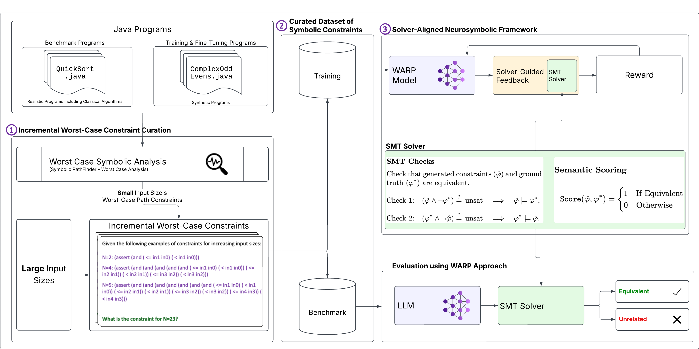

<h1 align="center">WARP-evaluation</h1>

<em>A comprehensive evaluation framework for testing Large Language Models on worst-case constraint generation and extrapolation tasks.</em>

  

<h2 align="center">Table of Contents</h2>

<ul>
  <li><a href="#overview">Overview</a></li>
  <li><a href="#getting-started">Getting Started</a></li>
  <li><a href="#benchmark-dataset">Benchmark Dataset</a></li>
  <li><a href="#analysis-capabilities">Analysis Capabilities</a></li>
  <li><a href="#citation">Citation</a></li>
</ul>

<h2 id="overview" align="center">Overview</h2>

  <strong>WARP-evaluation</strong> is designed to evaluate Large Language Models' capabilities in generating and extrapolating worst-case symbolic constraints for program analysis. This addresses a critical scalability gap where traditional symbolic execution tools like SPF-WCA cannot handle larger input sizes.

<h2 id="getting-started" align="center">Getting Started</h2>

<h3>Quick Start</h3>

<ol>
  <li><strong>Clone the repository:</strong>
    <pre><code>git clone https://github.com/dannkoh/WARP-evaluation.git
cd WARP-evaluation</code></pre>
  </li>
  
  <li><strong>Set up environment:</strong>
    <pre><code>pip install -r requirements.txt</code></pre>
  </li>
  
  <li><strong> Run local model evaluation:</strong>
    <pre><code>./script.sh</code></pre>
  </li>
  
  <li><strong>Or use the OpenAI notebook (batched) found in:</strong>
    <pre><code> src/gpt-evaluator.ipynb</code></pre>
  </li>

  <li><strong>Aggregate results:</strong> Once you are done with all the evaluations, run the aggregation script:
    <pre><code>./script_aggregate.sh</code></pre>  </li>
</ol>

<h3>Repository Structure</h3>

<pre>
WARP-evaluation/
├── src/                           # Evaluation scripts
│   ├── aggregate.py                  # Model result aggregation script
│   ├── gpt-evaluator.ipynb           # Batch OpenAI API evaluation notebook
│   ├── evaluator.py                  # Main evaluation script for local models
│   ├── utils/                        # Evaluation utilities
│   │   ├── configs.py                # Configuration management
│   │   └── evaluation.py             # Core evaluation logic
│   └── results_*/                    # Results for local model evaluation
├── results/                        # OpenAI evaluation results
│   ├── batch/                        # Batched OpenAI API requests and responses
│   └── trial*/                       # Multi-trial experimental data
├── output/                         # Generated output files
├── jpf-core/                       # Java PathFinder core
├── jpf-symbc/                      # Symbolic execution engine
├── spf-wca/                        # Symbolic PathFinder for worst-case analysis
├── script.sh                       # Main evaluation script
├── script_aggregate.sh             # Result aggregation script
├── requirements.txt                # Python dependencies
├── framework.png                   # Framework architecture diagram
└── README.md                       # Repository documentation
</pre>

<h2 id="benchmark-dataset" align="center">Benchmark Dataset</h2>

The <strong>WARP-benchmark</strong> dataset contains worst-case constraints extracted from Java programs using SPF-WCA.

The dataset is available for research purposes and can be accessed via the following link: <a href="https://github.com/dannkoh/WARP-benchmark">WARP-benchmark</a> on github and <a href="https://huggingface.co/datasets/dannkoh/WARP-benchmark">Hugging Face</a>.

<h2 id="analysis-capabilities" align="center">Analysis Capabilities</h2>

<h3>Logical Equivalence Validation</h3>

Uses Z3 SMT solver to verify that generated constraints are logically equivalent to ground truth:

<pre><code>def evaluate_with_z3(response, truth, constants):
    # Check: original_constraints ⟹ generated_constraints
    # Check: generated_constraints ⟹ original_constraints  
    # Return: True if bidirectional implication holds</code></pre>

<h3>Error Classification</h3>

<ul>
  <li><strong>Syntax Errors</strong>: Malformed SMT-LIB syntax</li>
  <li><strong>Semantic Errors</strong>: Logically incorrect constraints</li>
  <li><strong>Extraction Failures</strong>: Cannot parse response format</li>
</ul>

<h3>Performance Metrics</h3>

<ul>
  <li><strong>Overall Accuracy</strong>: Percentage of logically equivalent constraints</li>
  <li><strong>Tier-based Analysis</strong>: Performance across difficulty levels</li>
  <li><strong>Consistency Analysis</strong>: Variance across multiple trials</li>
</ul>

<h2 id="citation" align="center">Citation</h2>

If you use this evaluation framework in your research, please cite:

<pre><code>@misc{koh2025worstcasesymbolicconstraintsanalysis,
      title={Worst-Case Symbolic Constraints Analysis and Generalisation with Large Language Models}, 
      author={Daniel Koh and Yannic Noller and Corina S. Pasareanu and Adrians Skapars and Youcheng Sun},
      year={2025},
      eprint={2506.08171},
      archivePrefix={arXiv},
      primaryClass={cs.SE},
      url={https://arxiv.org/abs/2506.08171}, 
}</code></pre>

